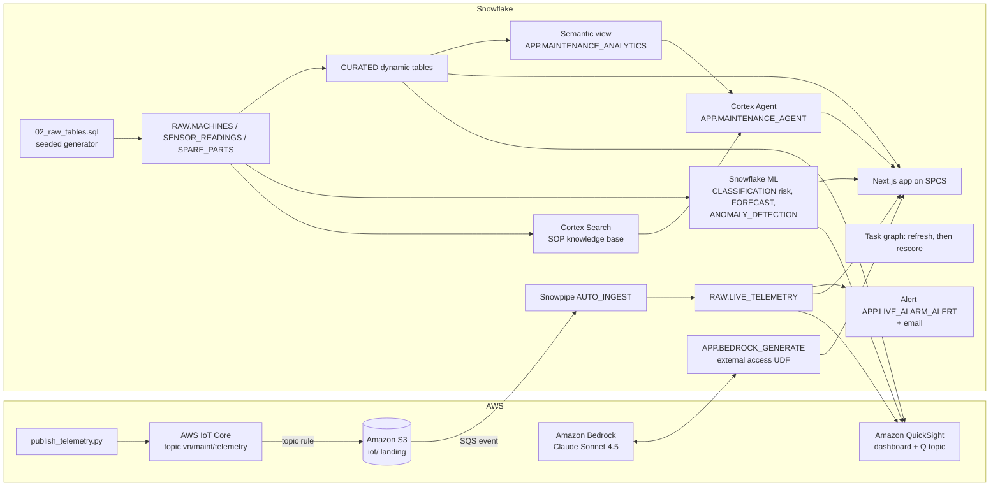

# Predictive Maintenance - Vietnam Electronics (AWS + Snowflake)

> Repair branch, validated end to end on 2026-10-08 in an isolated pilot database (`demo43`, AWS us-west-2).
> All data is synthetic. Every capability below was run and checked. See `demo_contract.json` for evidence.
> QuickSight Q answers were also checked in the Amazon Quick console and match Snowflake.
> QuickSight objects must be shared with the QuickSight user who signs in (`--principal-arn`); otherwise the console shows nothing.

The demo covers 20 synthetic SMT machines in Vietnam (Ho Chi Minh City, Hanoi, Binh Duong, Dong Nai, Can Tho) over 90 days, plus live simulated telemetry.

## Architecture



## What is implemented and validated

| Capability | Objects | Evidence |
|---|---|---|
| Synthetic data | 20 machines, 1,800 machine-days, spare parts | Seeded, so rebuilds reproduce it; per-machine uptime ranges from 94.6% to 99.96% |
| Dynamic tables | `CURATED.KPI_SUMMARY`, `PERFORMANCE_SUMMARY`, `DOWNTIME_CAUSES`, `TREND_ANALYSIS` | `run_core.py` recomputes KPIs from RAW and reconciles them |
| Failure-risk model | `ML.FAILURE_RISK_MODEL` / `_SCORES` / `_HOLDOUT_METRICS` | Out-of-time holdout: precision 0.60, recall 0.53, base rate 0.38 |
| Downtime forecast | `ML.DOWNTIME_FORECAST` | 14 days with prediction intervals |
| Anomaly detection | `ML.VIBRATION_ANOMALIES` | 25 of 320 machine-days flagged (last 15 days) |
| Cortex Search | `SEARCH.MAINTENANCE_SOP_SEARCH` | 14 synthetic SOPs, cited by ID in agent answers |
| Semantic view and agent | `APP.MAINTENANCE_ANALYTICS`, `APP.MAINTENANCE_AGENT` | Stops by type sum to 181, matching the KPI |
| IoT ingestion | IoT rule, then S3, then Snowpipe, into `RAW.LIVE_TELEMETRY` | 60 of 60 messages loaded; median lag 21 s |
| Bedrock | `APP.BEDROCK_GENERATE` (external access) | Writes the action memo in the app |
| Alert and email | `APP.LIVE_ALARM_ALERT`, `APP.ALERT_LOG` | New ALARM readings logged and emailed |
| Task graph | `APP.TASK_REFRESH_CURATED`, then `APP.TASK_RESCORE_RISK` | Both succeeded on demand |
| App (SPCS) | `APP.REPAIR_VN_MAINT_APP` | `/api/data`, `/api/ask` and `/api/agent` return 200 through ingress |
| QuickSight dashboard | `quicksight/build_dashboards.py` | v5 rendered in the cloud, with 5 visuals |
| QuickSight Q | `repair-vn-maint-topic` | Topic built and refreshed; **answers not yet checked by a person** |

Dropped from the legacy design: SageMaker (Snowflake ML does the modelling), Glue (dynamic tables) and Iceberg (not needed). None of them is claimed.

## AWS services

| Service | Role |
|---|---|
| AWS IoT Core | Receives simulated machine telemetry. A topic rule writes each message to S3 |
| Amazon S3 | Landing bucket. An event notification goes to the Snowpipe SQS queue |
| AWS IAM | Least-privilege roles for Snowflake to read S3 and IoT to write S3; an IAM user that can only invoke Bedrock Claude |
| Amazon Bedrock | Claude Sonnet 4.5 writes the action memo, called from Snowflake |
| Amazon QuickSight (+ Q) | DIRECT_QUERY dashboard over Snowflake and a Q topic |
| AWS Secrets Manager | Holds the QuickSight service credential |

## Personas (fictional)

| Persona | Role | Key Questions |
|---------|------|---------------|
| **Hoang Duc Long** | VP Engineering | "Which machines drive unplanned downtime?" "What is fleet uptime?" |
| **Vu Thi Nga** | Maintenance Engineer | "Which machines are high failure risk this week, and which SOP applies?" |

## Build (on demand)

Prerequisites:
- Python 3.11+, `snowflake-connector-python`, `boto3`, Node.js 22+, Docker and the `snow` CLI.
- An X-Small warehouse with auto-suspend at or below 120 s.
- AWS credentials for the target account, with QuickSight Enterprise for the dashboard.

```bash
# 1. Core data and dynamic tables (guarded: new isolated database only)
python snowflake/run_core.py --database REPAIR_VIETNAM_MAINTENANCE_X --warehouse HOL_GEN2_WH --apply
# 2. AWS ingestion and Bedrock (dry run first, then --apply)
python aws/setup_aws.py --database REPAIR_VIETNAM_MAINTENANCE_X --account <aws-account> --apply
# 3. ML, search, semantic view, agent, alert and task graph
python snowflake/run_intelligence.py --database REPAIR_VIETNAM_MAINTENANCE_X --alert-email you@example.com
# 4. App on SPCS: build and push the image, then run 07_deploy_app.sql (see the header of that file)
python snowflake/run_intelligence.py --database REPAIR_VIETNAM_MAINTENANCE_X --alert-email you@example.com --files 07_deploy_app.sql
# 5. QuickSight (needs an existing Snowflake data source)
python quicksight/build_dashboards.py --database REPAIR_VIETNAM_MAINTENANCE_X ... --apply --update --with-topic
# Tests
python -m pytest aws snowflake quicksight
```

During the demo:
- Run `python aws/publish_telemetry.py --count 20` to send live readings.
- Run `EXECUTE ALERT APP.LIVE_ALARM_ALERT` to raise the alarm email.
- Run `EXECUTE TASK APP.TASK_REFRESH_CURATED` to refresh the curated tables and rescore risk.

Afterwards, `python aws/teardown_aws.py ... --apply` removes the AWS resources and the account-level integrations.

For a local run, put `SNOWFLAKE_ACCOUNT`, `SNOWFLAKE_USER`, `SNOWFLAKE_DATABASE`, `SNOWFLAKE_WAREHOUSE`, `SNOWFLAKE_AUTHENTICATOR=PROGRAMMATIC_ACCESS_TOKEN` and `SNOWFLAKE_TOKEN` in the environment, then run `npm --prefix app run build && npm --prefix app start`.

## Business context

Every figure in this section has been checked against its source. Industry statistics that appeared in earlier versions (a VEIA facility and downtime share, McKinsey maintenance-cost ranges, IPC SMT spare-parts values, a Bosch downtime reduction) have been **removed**: their sources were inaccessible or contained no supporting passage. Do not reintroduce them without an exact source passage.

- **Siemens** (Snowflake customer) built the Siemens Data Cloud on Snowflake. It reports 600+ projects across business divisions and 4,800 data warehouses integrated. It replicates more than 50 ERP systems and over 1.5 billion changes per day using SNP Glue. A proof of concept across three factory automation sites in Germany and China assigns supply-chain risk scores to materials at risk of undersupply. It also uses Snowflake as a data source for Amazon SageMaker Data Wrangler. This is a supply-chain and data-platform reference, not a predictive-maintenance outcome. Source: [Snowflake customer story](https://www.snowflake.com/en/customers/all-customers/case-study/siemens-1/), retrieved 2026-10-08.

## Demo numbers (synthetic, from the validated build)

- 20 machines, 1,800 machine-days over 90 days
- Fleet uptime 98.65%; per-machine uptime ranges from 94.6% to 99.96%
- 181 unplanned stops across 10 root causes
- Failure-risk model holdout: precision 0.60, recall 0.53 at a 0.5 threshold, against a 0.38 base rate

All figures are synthetic and illustrative. They are not customer data.

## License

Apache 2.0 — See [LICENSE](LICENSE) for details.

This is a personal demo project and is not an official Snowflake offering. It comes with no support or warranty.