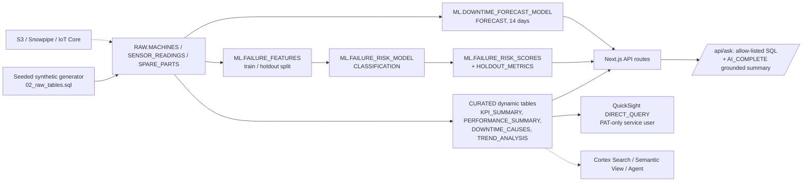

# Predictive Maintenance

> Repair branch: pilot validation in progress, not an end-to-end demo certification.
> Validated so far: core pipeline, 7-day failure-risk model and downtime forecast (`05_ml.sql`),
> grounded AI answers, and the QuickSight dashboard. See `demo_contract.json` for status.
> The legacy sections below are under review; do not present their metrics or claims as validated.

## Validated repair workflow

Use Python 3.11+ with `snowflake-connector-python`, Node.js 22+, and an existing
X-Small Snowflake warehouse with auto-suspend at or below 120 seconds.
The guarded runner currently accepts only the authorized `demo43` pilot account
and a **new** database beginning `REPAIR_VIETNAM_MAINTENANCE_`. It refuses existing
databases and never replaces the running demo. Inspect the dry run first:

```bash
python snowflake/run_core.py --database REPAIR_VIETNAM_MAINTENANCE_TEST --warehouse HOL_GEN2_WH
python snowflake/run_core.py --database REPAIR_VIETNAM_MAINTENANCE_TEST --warehouse HOL_GEN2_WH --apply
python snowflake/test_run_core.py
# then, with SET DEMO_DB / DEMO_WH for the same database:
# snowflake/05_ml.sql  (failure-risk classifier, holdout metrics, 14-day forecast)
python quicksight/test_build_dashboards.py
npm --prefix app ci
npm --prefix app run build
```

The runner executes only 00/02/03/04 and renders the validated warehouse
identifier in the DT DDL. Do not execute these files individually without the
session variables and rendering step. It creates 20 synthetic machines, 1,800
machine-day observations and 20 spare-part records, using HASH-seeded randomness so
machines differ in reliability, shifts, PM discipline, repair time and root causes; reconciles core measures;
and suspends the four initialized dynamic tables. Retain the isolated namespace
for inspection. A failed run leaves its isolated evidence intact; use a new name
for a clean retry, not a destructive reset.

The UI shows unavailable/error states instead of fallback values. Its API now
requires the repaired core schema. Do not point it at the old live database or
cut over the deployed service yet. Search, semantic view/agent, AWS ingestion, deployed UI
and Q answer validation are still pending. QuickSight generation
is dry-run by default (`python quicksight/build_dashboards.py --help`); `--apply`
is explicit and requires an existing data source and principal. Successful API
creation is not proof of rendered charts or correct Q answers.

## Legacy target overview (not yet certified)

Predictive Maintenance for Vietnam - ML.FORECAST and Dynamic Tables power real-time predictive maintenance intelligence for electronics manufacturing in Bac Ninh & Vinh Phuc.

## Architecture (validated pilot path)

Solid lines are built and validated in the pilot. Dotted lines are legacy targets that are **not** implemented or validated yet: `05_search.sql`, `06_ml_models.sql`, `07`–`11`, AWS ingestion, Bedrock and SageMaker.



## What is implemented

| Capability | Status | Objects |
|---|---|---|
| Synthetic data | Validated | 20 machines, 1,800 machine-days (90 days), spare parts |
| Dynamic tables | Validated, reconciled with RAW (`run_core.py`) | `CURATED.KPI_SUMMARY`, `PERFORMANCE_SUMMARY`, `DOWNTIME_CAUSES`, `TREND_ANALYSIS` |
| Failure-risk classification | Validated on holdout | `ML.FAILURE_RISK_MODEL`, `ML.FAILURE_RISK_SCORES`, `ML.FAILURE_RISK_HOLDOUT_METRICS` |
| Downtime forecast | Built | `ML.DOWNTIME_FORECAST_MODEL`, `ML.DOWNTIME_FORECAST` |
| Grounded AI answers | Validated | `/api/ask` (allow-listed queries plus `AI_COMPLETE`) |
| QuickSight dashboard | Rendering verified | `quicksight/build_dashboards.py` |
| QuickSight Q | Topic created; answers not yet tested | |
| Cortex Search, Semantic View, Agent, anomaly detection, alerts, AWS ingestion | **Not validated**; legacy scripts under repair | `05_search.sql`, `06`–`11` |

## AWS services

| Service | Status |
|---|---|
| Amazon QuickSight | Implemented: Snowflake data source, dashboard |
| Amazon QuickSight Q | Topic only; not validated |
| AWS Secrets Manager | Stores the QuickSight service credential |
| AWS IoT Core, S3/Iceberg, Glue, SageMaker, Bedrock | Legacy design targets, not implemented in this repo |

## Personas

| Persona | Role | Key Questions |
|---------|------|---------------|
| **Hoang Duc Long** | VP Engineering | "Which machines drive unplanned downtime?" "What is fleet uptime?" |
| **Vu Thi Nga** | Maintenance Engineer | "Which machines are high failure risk this week?" "What are the top root causes?" |

## Build instructions

Prerequisites: a Snowflake role that can create a database and models, an X-Small warehouse, and access to Cortex `AI_COMPLETE`. QuickSight additionally needs an AWS account with QuickSight Enterprise.

Follow the guarded core workflow above (`run_core.py`), then `05_ml.sql`. The historical scripts `05_search.sql` through `11` are not a supported deployment path yet.

## Business context

Every figure in this section has been checked against its source. Industry statistics that appeared in earlier versions (a VEIA facility and downtime share, McKinsey maintenance-cost ranges, IPC SMT spare-parts values, a Bosch downtime reduction) have been **removed**: their sources were inaccessible or contained no supporting passage. Do not reintroduce them without an exact source passage.

- **Siemens** (Snowflake customer) built the Siemens Data Cloud on Snowflake. It reports 600+ projects across business divisions and 4,800 data warehouses integrated. It replicates more than 50 ERP systems and over 1.5 billion changes per day using SNP Glue. A proof of concept across three factory automation sites in Germany and China assigns supply-chain risk scores to materials at risk of undersupply. It also uses Snowflake as a data source for Amazon SageMaker Data Wrangler. This is a supply-chain and data-platform reference, not a predictive-maintenance outcome. Source: [Snowflake customer story](https://www.snowflake.com/en/customers/all-customers/case-study/siemens-1/), retrieved 2026-10-08.

## Demo numbers (synthetic, from the validated build)

- 20 machines, 1,800 machine-days over 90 days
- Fleet uptime 98.65%; per-machine uptime ranges from 94.6% to 99.96%
- 181 unplanned stops across 10 root causes
- Failure-risk model holdout: precision 0.60, recall 0.53 at a 0.5 threshold, against a 0.38 base rate

All figures are synthetic and illustrative. They are not customer data.

## License

Apache 2.0 — See [LICENSE](LICENSE) for details.

This is a personal demo project and is not an official Snowflake offering. It comes with no support or warranty.