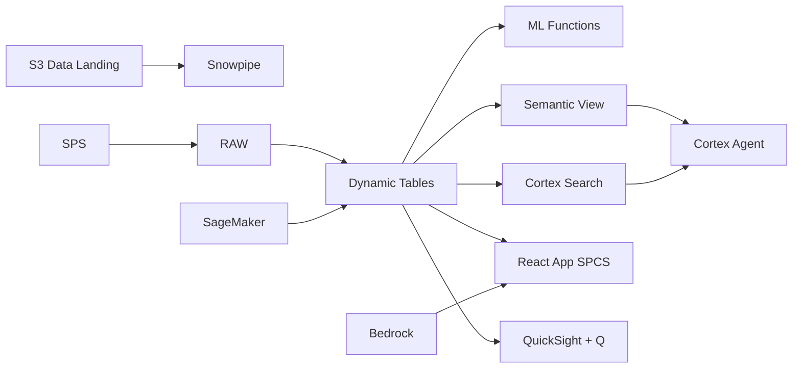

# Predictive Maintenance

> Repair branch: pilot validation in progress, not an end-to-end demo certification.
> Validated so far: core pipeline, 7-day failure-risk model and downtime forecast (`05_ml.sql`),
> grounded AI answers, and the QuickSight dashboard. See `demo_contract.json` for status.
> The legacy sections below are under review; do not present their metrics or claims as validated.

## Validated repair workflow

Use Python 3.11+ with `snowflake-connector-python`, Node.js 22+, and an existing
X-Small Snowflake warehouse with auto-suspend at or below 120 seconds.
The guarded runner currently accepts only the authorized `demo43` pilot account
and a **new** database beginning `REPAIR_VIETNAM_MAINTENANCE_`. It refuses existing
databases and never replaces the running demo. Inspect the dry run first:

```bash
python snowflake/run_core.py --database REPAIR_VIETNAM_MAINTENANCE_TEST --warehouse HOL_GEN2_WH
python snowflake/run_core.py --database REPAIR_VIETNAM_MAINTENANCE_TEST --warehouse HOL_GEN2_WH --apply
python snowflake/test_run_core.py
# then, with SET DEMO_DB / DEMO_WH for the same database:
# snowflake/05_ml.sql  (failure-risk classifier, holdout metrics, 14-day forecast)
python quicksight/test_build_dashboards.py
npm --prefix app ci
npm --prefix app run build
```

The runner executes only 00/02/03/04 and renders the validated warehouse
identifier in the DT DDL. Do not execute these files individually without the
session variables and rendering step. It creates 20 synthetic machines, 1,800
machine-day observations and 20 spare-part records, using HASH-seeded randomness so
machines differ in reliability, shifts, PM discipline, repair time and root causes; reconciles core measures;
and suspends the four initialized dynamic tables. Retain the isolated namespace
for inspection. A failed run leaves its isolated evidence intact; use a new name
for a clean retry, not a destructive reset.

The UI shows unavailable/error states instead of fallback values. Its API now
requires the repaired core schema. Do not point it at the old live database or
cut over the deployed service yet. Model, AI, search, AWS ingestion, deployed UI,
and QuickSight/Q functional validation are still pending. QuickSight generation
is dry-run by default (`python quicksight/build_dashboards.py --help`); `--apply`
is explicit and requires an existing data source and principal. Successful API
creation is not proof of rendered charts or correct Q answers.

## Legacy target overview (not yet certified)

Predictive Maintenance for Vietnam - ML.FORECAST and Dynamic Tables power real-time predictive maintenance intelligence for electronics manufacturing in Bac Ninh & Vinh Phuc.

## Architecture

Vietnam electronics manufacturing faces increasing complexity in predictive maintenance. Decision-makers in Bac Ninh & Vinh Phuc need real-time intelligence and ML-powered recommendations.



## Snowflake Capabilities

| Capability | Implementation |
|-----------|---------------|
| Dynamic Tables | PERFORMANCE_DASHBOARD / TREND_ANALYTICS / FORECAST_INPUT / OPERATIONAL_RISK |
| ML Functions | ML.FORECAST + ML.ANOMALY_DETECTION |
| Cortex AI | COMPLETE, SUMMARIZE, AI_CLASSIFY |
| Cortex Search | 100 documents indexed |
| Cortex Agent | ELECTRONICS_MAINTENANCE_AGENT |
| Semantic View | ELECTRONICS_MAINTENANCE_ANALYTICS |
| React App (SPCS) | 5 tabs + DemoGuide |


## AWS Services

| Service | Role in Demo |
|---------|-------------|
| AWS IoT Core | Ingest real-time data from electronics manufacturing systems |
| Amazon SageMaker | Predictive Maintenance ML models |
| AWS Glue | ETL and data transformation |
| Apache Iceberg (S3) | Open table format for data sharing |
| Amazon Bedrock (Claude) | Generate predictive maintenance recommendations |
| Amazon QuickSight + Q | Predictive Maintenance dashboard with NL queries |


## Personas

| Persona | Role | Key Questions |
|---------|------|---------------|
| **Hoang Duc Long** | VP Engineering | "What are the key predictive maintenance metrics?" "Which areas need attention?" |
| **Vu Thi Nga** | Maintenance Engineer | "Show me the trend analysis." "Which operations are underperforming?" |


## Data

| Table | Rows | Description |
|-------|------|-------------|
| OPERATIONS | 100,000 | Core operational records for predictive maintenance |
| METRICS | 500,000 | Time-series performance metrics |
| ASSETS | 5,000 | Asset and entity master data |
| EVENTS | 200,000 | Operational events and incidents |
| DOCUMENTS | 100 | SOPs, reports, and compliance docs |


## Build Instructions

### Prerequisites
- Snowflake account with ACCOUNTADMIN access
- Cortex AI enabled (ML Functions, Search, Agent)
- Warehouse: ELECTRONICS_WH (Medium)
- AWS CLI with access (us-west-2)

### Deployment

See the guarded core workflow above. The historical all-script sequence is not
currently a supported fresh-deployment path; downstream scripts remain under repair.

### React App (SPCS)
```bash
cd app && npm ci && npm run build
docker build -t aws-vietnam-electronics-maintenance-app .
docker push bdiqc8sm-default.registry.snowflakecomputing.com/electronics_maintenance/app/aws_vietnam_electronics_maintenance/app:latest
```

### Demo Mode
Open the app URL with `?demo=true` for presenter view.

## Build Modes

### Snowflake Only
Run scripts 00-08 (skip AWS-specific integration). Uses:
- **Snowpipe Streaming SDK** instead of AWS IoT Core
- **ML.FORECAST + ML.ANOMALY_DETECTION** instead of Amazon SageMaker
- **Dynamic Tables** instead of AWS Glue
- **Snowflake-managed Iceberg Tables** instead of Apache Iceberg (S3)
- **Cortex Complete** instead of Amazon Bedrock (Claude)
- **Snowflake Intelligence (Cortex Analyst)** instead of Amazon QuickSight + Q

### Full AWS + Snowflake
Run all scripts including AWS integration. Deploy QuickSight dashboard from `quicksight/`.

## Business Impact

Industry research and Snowflake customer outcomes:
- **Vietnam has 500+ electronics manufacturing facilities — equipment failure accounts for 23% of total downtime** — [Vietnam Electronics Industries Association](https://veia.org.vn/)
- **Predictive maintenance reduces maintenance costs 25-30% and eliminates 70-75% of equipment breakdowns** — [McKinsey Operations](https://www.mckinsey.com/capabilities/operations/our-insights/maintenance-4-0)
- **SMT (Surface Mount Technology) lines require $500K-$2M in spare parts inventory — AI optimization reduces this 20%** — [IPC/Global Electronics Association](https://www.electronics.org/electronics-industry-data)
- **Bosch achieved 25% reduction in unplanned downtime using ML-based equipment health monitoring** — [Bosch Industry 4.0](https://www.bosch.com/stories/industry-4-0/)
- **Siemens** (Snowflake customer): processes 2+ petabytes of manufacturing data on Snowflake for real-time yield and quality analytics across global fabs -- [snowflake.com/customers/siemens](https://www.snowflake.com/en/customers/all-customers/case-study/siemens-1/)

## Key Demo Numbers

- **100K operations** tracked in Bac Ninh & Vinh Phuc
- **500K metrics** time-series data points
- **5K assets** monitored
- **100 docs** searchable


## License

Apache 2.0 — See [LICENSE](LICENSE) for details.

This is a personal demo project and is not an official Snowflake offering. It comes with no support or warranty.