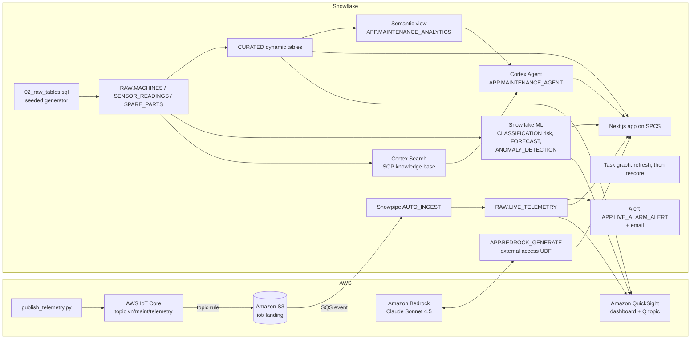

# APJ Predictive Maintenance - Vietnam Electronics

End-to-end predictive maintenance for **20 SMT machines across 5 Vietnamese locations** (Ho Chi Minh City, Hanoi, Binh Duong, Dong Nai, Can Tho) using Snowflake, optionally with AWS: from live sensor reading to a failure-risk score, an alarm email and an AI action memo.

## Architecture

A predictive maintenance pipeline built on **Snowflake** (Dynamic Tables, Snowflake ML, Cortex Search, Cortex Agent, Cortex AI_COMPLETE, SPCS) and, in the full build, **AWS** (IoT Core, S3, Bedrock Claude, QuickSight + Amazon Q). Machine telemetry lands in `RAW.LIVE_TELEMETRY`. Dynamic tables curate 90 days of machine history. Snowflake ML scores 7-day failure risk, forecasts downtime and flags vibration anomalies. A Cortex Agent answers questions with SOP citations, and an LLM drafts the maintenance action memo.

Interactive diagrams (hover for object names): [Snowflake only](docs/architecture-snowflake.html) | [AWS + Snowflake](docs/architecture-aws.html). The app shows the matching diagram on its Architecture & Data tab. Regenerate both with `python3 docs/build_architecture.py`.



The Snowflake-only build drops the AWS subgraph: `APP.SIMULATE_TELEMETRY` writes to `RAW.LIVE_TELEMETRY`, and the app calls Cortex `AI_COMPLETE` instead of the Bedrock UDF.

## Snowflake Capabilities

| Capability | Implementation |
|-----------|---------------|
| Dynamic Tables | `CURATED.KPI_SUMMARY`, `PERFORMANCE_SUMMARY`, `DOWNTIME_CAUSES`, `TREND_ANALYSIS` from the RAW tables |
| Snowflake ML | CLASSIFICATION 7-day failure risk (`ML.FAILURE_RISK_SCORES`), 14-day downtime FORECAST, vibration ANOMALY_DETECTION |
| Cortex Search | 14 synthetic SOPs (one per equipment class and failure mode) in `SEARCH.MAINTENANCE_SOP_SEARCH` |
| Semantic View | `APP.MAINTENANCE_ANALYTICS` over machines, downtime and risk |
| Cortex Agent | `APP.MAINTENANCE_AGENT`: Cortex Analyst over the semantic view plus Cortex Search for SOP citations |
| Cortex AI | `AI_COMPLETE('claude-sonnet-4-5')` for grounded answers, and for the action memo in the Snowflake-only build |
| Alerts + Tasks | `APP.LIVE_ALARM_ALERT` logs ALARM readings and sends email; task graph `TASK_REFRESH_CURATED`, then `TASK_RESCORE_RISK` |
| Snowpark Container Services | Next.js app `APP.REPAIR_VN_MAINT_APP` with 6 tabs: Executive Cockpit, Predictive, PM Planning, Live IoT, Ask AI, Architecture & Data |
| Snowpipe | `RAW.LIVE_TELEMETRY_PIPE` AUTO_INGEST from S3 (AWS build only) |

## AWS Services

Used only in the AWS + Snowflake build.

| Service | Role in Demo |
|---------|-------------|
| AWS IoT Core | Receives simulated machine telemetry. A topic rule writes each message to S3 |
| Amazon S3 | Landing bucket. An event notification goes to the Snowpipe SQS queue |
| Amazon Bedrock | Claude Sonnet 4.5 writes the action memo, called from Snowflake through an external-access UDF |
| Amazon QuickSight | DIRECT_QUERY executive dashboard over Snowflake (downtime by machine, daily uptime, failure risk) |
| Amazon Q | Natural-language questions over the QuickSight topic `repair-vn-maint-topic` |
| AWS IAM / Secrets Manager | Least-privilege roles for S3, IoT and Bedrock; the QuickSight service credential |

## Personas

These personas are fictional.

| Persona | Role | Key Questions |
|---------|------|---------------|
| **Hoang Duc Long** | VP Engineering | "Which machines drive unplanned downtime?" "What is fleet uptime?" |
| **Vu Thi Nga** | Maintenance Engineer | "Which machines are high failure risk this week, and which SOP applies?" |

## Data

All data is synthetic and seeded, so every rebuild reproduces it.

| Table | Rows | Description |
|-------|------|-------------|
| RAW.MACHINES | 20 | SMT machines across 5 regions and 4 equipment classes (Pick and Place, Reflow Oven, Conveyor, AOI Station) |
| RAW.SENSOR_READINGS | 1,800 | Daily machine observations over 90 days: planned, operating and downtime hours, failures, root cause, PM, units, vibration and temperature |
| RAW.SPARE_PARTS | 20 | Required, on-hand and on-order spare parts per machine |
| SEARCH.MAINTENANCE_DOCS | 14 | Synthetic SOPs indexed for Cortex Search |
| RAW.LIVE_TELEMETRY | Grows during the demo | Live readings from IoT Core (AWS build) or `APP.SIMULATE_TELEMETRY` (Snowflake-only build) |
| ML.FAILURE_RISK_SCORES | 20 | 7-day failure probability and risk band per machine |

## Build Instructions

### Prerequisites
- Snowflake account with ACCOUNTADMIN access, and Cortex AI enabled (AI_COMPLETE, Search, Agent).
- An X-Small warehouse with auto-suspend at or below 120 s, and an existing SPCS compute pool.
- Python 3.11+, `snowflake-connector-python`, Node.js 22+, Docker and the `snow` CLI.
- App image: run `snow spcs image-registry login`, then build and push `vn-maint-app:v3` to the database's `APP.IMAGES` repository (see the header of `snowflake/07_deploy_app.sql`).
- AWS build only: `boto3`, AWS credentials for the target account (us-west-2) with Bedrock access, and QuickSight Enterprise.

### SPCS App
```
<DATABASE>.APP.REPAIR_VN_MAINT_APP
```

### Tests
```bash
python -m pytest aws snowflake quicksight
```

For a local run, put `SNOWFLAKE_ACCOUNT`, `SNOWFLAKE_USER`, `SNOWFLAKE_DATABASE`, `SNOWFLAKE_WAREHOUSE`, `SNOWFLAKE_AUTHENTICATOR=PROGRAMMATIC_ACCESS_TOKEN`, `SNOWFLAKE_TOKEN` and `DEMO_PLATFORM` in the environment, then run `npm --prefix app run build && npm --prefix app start`.

## Build Modes

Both modes share the same core. They differ in three places, and the app's `DEMO_PLATFORM` setting (in its SPCS spec) switches the memo provider, the Live IoT tab and the diagram.

| Layer | Snowflake Only | Full AWS + Snowflake |
|---|---|---|
| Live telemetry | `CALL APP.SIMULATE_TELEMETRY(n)` inserts simulated readings into `RAW.LIVE_TELEMETRY`. This simulates a sensor feed; it is not Snowpipe Streaming | `aws/publish_telemetry.py` to AWS IoT Core, then S3, SQS and Snowpipe AUTO_INGEST |
| Action memo | Cortex `AI_COMPLETE('claude-sonnet-4-5')` | Amazon Bedrock Claude Sonnet 4.5 through `APP.BEDROCK_GENERATE` |
| BI and natural-language questions | The SPCS app is the dashboard; questions go to the Cortex Agent | Also a QuickSight dashboard and an Amazon Q topic |
| App setting | `DEMO_PLATFORM: snowflake` | `DEMO_PLATFORM: aws` |

### Snowflake Only

```bash
# 1. Core data and dynamic tables (guarded: new isolated database only)
python snowflake/run_core.py --database REPAIR_VIETNAM_MAINTENANCE_X --warehouse HOL_GEN2_WH --apply
# 2. Native telemetry, ML, search, semantic view, agent, alert and task graph
python snowflake/run_intelligence.py --database REPAIR_VIETNAM_MAINTENANCE_X --platform snowflake --alert-email you@example.com
# 3. App on SPCS with DEMO_PLATFORM=snowflake (push the image first)
python snowflake/run_intelligence.py --database REPAIR_VIETNAM_MAINTENANCE_X --platform snowflake --alert-email you@example.com --files 07_deploy_app.sql
```

During the demo:
- Run `CALL APP.SIMULATE_TELEMETRY(20)` to add live readings. For a continuous feed, run `ALTER TASK APP.TASK_SIMULATE_TELEMETRY RESUME`, and `SUSPEND` it afterwards.
- Run `EXECUTE ALERT APP.LIVE_ALARM_ALERT` to raise the alarm email.
- Run `EXECUTE TASK APP.TASK_REFRESH_CURATED` to refresh the curated tables and rescore risk.

Afterwards, drop the database or run `ALTER SERVICE APP.REPAIR_VN_MAINT_APP SUSPEND`.

### Full AWS + Snowflake

```bash
# 1. Core data and dynamic tables (guarded: new isolated database only)
python snowflake/run_core.py --database REPAIR_VIETNAM_MAINTENANCE_X --warehouse HOL_GEN2_WH --apply
# 2. AWS ingestion and Bedrock (dry run first, then --apply)
python aws/setup_aws.py --database REPAIR_VIETNAM_MAINTENANCE_X --account <aws-account> --apply
# 3. ML, search, semantic view, agent, alert and task graph
python snowflake/run_intelligence.py --database REPAIR_VIETNAM_MAINTENANCE_X --platform aws --alert-email you@example.com
# 4. App on SPCS with DEMO_PLATFORM=aws (push the image first)
python snowflake/run_intelligence.py --database REPAIR_VIETNAM_MAINTENANCE_X --platform aws --alert-email you@example.com --files 07_deploy_app.sql
# 5. QuickSight dashboard and Q topic (needs an existing Snowflake data source)
python quicksight/build_dashboards.py --database REPAIR_VIETNAM_MAINTENANCE_X ... --apply --update --with-topic
```

QuickSight objects must be shared with the QuickSight user who signs in (`--principal-arn`); otherwise the console shows nothing.

During the demo:
- Run `python aws/publish_telemetry.py --count 20` to send live readings.
- Run `EXECUTE ALERT APP.LIVE_ALARM_ALERT` to raise the alarm email.
- Run `EXECUTE TASK APP.TASK_REFRESH_CURATED` to refresh the curated tables and rescore risk.

Afterwards, `python aws/teardown_aws.py ... --apply` removes the AWS resources and the account-level Bedrock external-access and S3 storage integrations. It leaves the email integration `REPAIR_VN_MAINT_EMAIL_INT`, which the Snowflake-only build also uses.

## Business Impact

Industry research and Snowflake customer outcomes:
- **Predictive maintenance**, on average, increases productivity by 25%, reduces breakdowns by 70% and lowers maintenance costs by 25% -- [Deloitte Analytics Institute, Predictive Maintenance position paper](https://www.deloitte.com/content/dam/assets-zone2/de/de/docs/about/2024/Deloitte_Predictive-Maintenance_PositionPaper.pdf)
- **Equipment uptime** increases by 10 to 20%, while overall maintenance costs fall by 5 to 10% and maintenance planning time by 20 to 50% -- [same Deloitte paper](https://www.deloitte.com/content/dam/assets-zone2/de/de/docs/about/2024/Deloitte_Predictive-Maintenance_PositionPaper.pdf)
- **Scania** (Snowflake customer) streams data from 600,000 connected vehicles (150 million streaming messages) into Snowflake. It has "been able to reduce downtime for customers by recommending maintenance based on vehicle operation and workshop availability" -- [Snowflake Manufacturing Data Cloud press release](https://www.snowflake.com/en/news/press-releases/snowflake-launches-manufacturing-data-cloud-to-improve-supply-chain-performance-and-power-smart-manufacturing/)
- **Siemens** (Snowflake customer) runs the Siemens Data Cloud on Snowflake: 600+ projects, 4,800 data warehouses integrated, and more than 50 ERP systems replicated at over 1.5 billion changes per day. This is a data-platform reference, not a predictive-maintenance outcome -- [snowflake.com/customers/siemens](https://www.snowflake.com/en/customers/all-customers/case-study/siemens-1/)

Each figure above was checked against its source on 2026-10-08. Earlier figures whose sources were inaccessible or did not contain the claim (a VEIA facility and downtime share, McKinsey maintenance-cost ranges, IPC SMT spare-parts values, a Bosch downtime reduction) were removed and must not be reintroduced without an exact source passage.

## Key Demo Numbers

These figures are synthetic and come from the validated builds.

- **20 machines**, 1,800 machine-days over 90 days, across 5 locations
- **Fleet uptime 98.65%**; per-machine uptime ranges from 94.6% to 99.96%
- **181 unplanned stops** across 10 root causes
- **Failure-risk model** out-of-time holdout: precision 0.60, recall 0.53 at a 0.5 threshold, against a 0.38 base rate. The top machine is MAC-0013, at 96.53%
- **14-day downtime forecast** with prediction intervals; **25 of 320** machine-days flagged as vibration anomalies
- **14 SOPs** indexed for Cortex Search and cited by ID in agent answers

## Validation

Both builds were validated end to end on 2026-10-08 in isolated pilot databases on `demo43` (AWS us-west-2). Evidence is in `demo_contract.json` (`builds`, `required_capabilities`).

| Check | Snowflake Only (`REPAIR_VIETNAM_MAINTENANCE_20261008_SF`) | AWS + Snowflake (`REPAIR_VIETNAM_MAINTENANCE_20261007_C`) |
|---|---|---|
| Core KPIs and ML | Same KPIs (181 stops); MAC-0013 at 96.53% | Same; KPIs reconciled to a RAW recomputation |
| Live telemetry | 40 of 40 simulated readings landed; 3 ALARM readings logged | 60 of 60 IoT messages loaded; median lag 21 s at first validation |
| Action memo | `/api/ask` memo returned by Cortex AI_COMPLETE | `/api/ask` memo returned by Amazon Bedrock |
| Agent and search | `/api/agent` answers with SOP citations | Same |
| App | `/api/data`, `/api/ask` and `/api/agent` return 200 through SPCS ingress | Same |
| QuickSight | Not used | Dashboard v5 renders with 5 visuals. Amazon Q, checked by a person, matches the top 5 in `ML.FAILURE_RISK_SCORES` |

Dropped from the legacy design: SageMaker (Snowflake ML does the modelling), Glue (replaced by dynamic tables) and Iceberg (not needed). None of them is claimed.

## License

Apache 2.0 — See [LICENSE](LICENSE) for details.

This is a personal demo project and is not an official Snowflake offering. It comes with no support or warranty. Industry metrics cited are from publicly available third-party research and Snowflake customer stories; they represent reported outcomes and are not guarantees of results.
